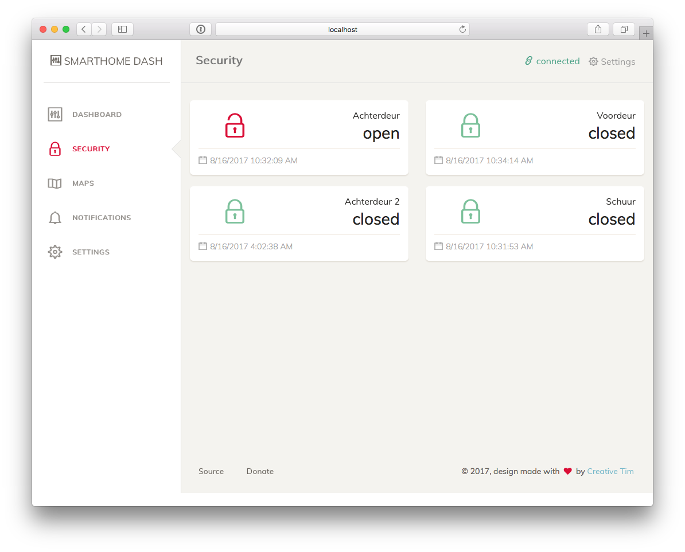

# Smarthome dash
[![version][version-badge]][CHANGELOG]
[![license][license-badge]][LICENSE]
[](https://✌️.tk/beer)



This projects aims to create a dashboard for your Home Automation system. It connects to your local mqtt server by using websockets. Since this is an Angular application, it runs fully in the browser. And for conveniance it is hosted on [Github Pages](https://svrooij.github.io/smarthome-dash), but that could be any server you wish.

## Connection settings

You can input your connection settings in the settings screen, these settings will be saved to the browsers `localStorage`, see [setting.service.ts](./src/app/settings/settings.serrvice.ts). These settings are NEVER transmitted to any other server, then your own mqtt server.

## MQTT Smarthome

This dashboard is inspired by the [MQTT Smarthome](https://github.com/mqtt-smarthome/mqtt-smarthome) specs. It will automatically subscribe to `+/status/#`, so all those devices will be automatically added.

## Work in progress

At the moment this project is still "Work in progress", but you should get the idea. That is also way currently only doormagnets are implemented.

## Run it yourself

This project is created with the [Angular CLI](https://cli.angular.io), so you can use all the known commands.

```bash
# Serve to localhost
ng serve

# Lint your code add --fix for auto fixing some errors.
ng lint

# Build the application add --aot for Ahead-of-time compiling
ng build

# deploy your fork to your github pages.
npm run deploy
```

## Designed by Creative Tim

My design skills aren't very good, but Creative Tim did a good job on the design. [More info](./README.design.md)